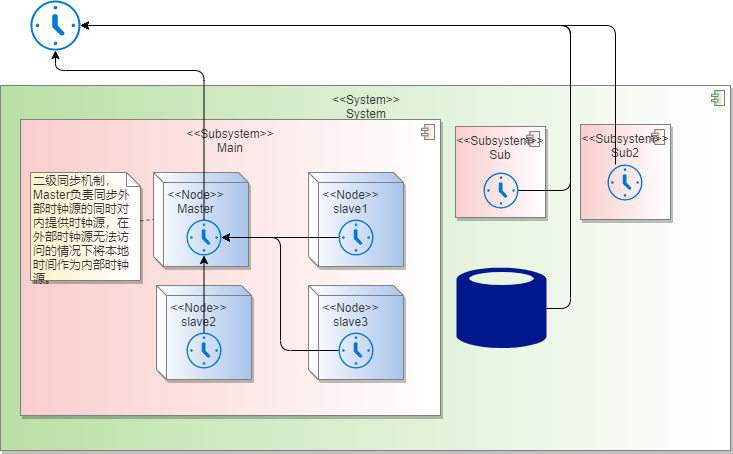
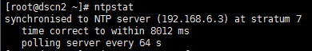
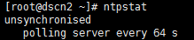
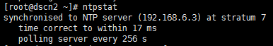
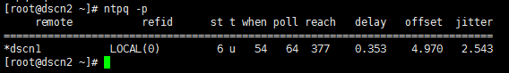
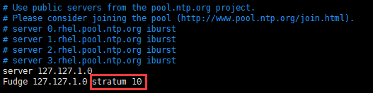
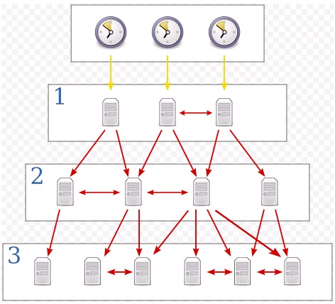
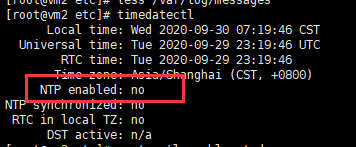

## 1. 什么是NTP,why we need it?

​		如今我们的软件系统通常部署在计算设备集群中，而非单一的物理设备上。统一、同步的标准时间用于记录各种事件发生时序，如日志的打印时间戳、微服务调用链监控、文件创建和访问时间、E-MAIL时间戳、数据库处理时间等。系统内不同计算设备之间控制、计算、处理、应用等数据或操作都具有时序性，若计算机时间不同步，这些应用或操作或将无法正常进行。

​		大数据系统是对时间敏感的计算处理系统，时间同步是大数据能够得到正确处理的基础保障，是大数据得以发挥作用的技术支撑。大数据时代，整个处理计算系统内的大数据通信都是通过网络进行。时间同步也是如此，利用大数据的互联网络传送标准时间信息，实现大数据系统内时间同步。

​		网络时间同步协议(NTP)是时间同步的技术基础。

​		首先看下官网http://www.ntp.org/对它的定义。

>**NTP is a protocol designed to synchronize the clocks of computers over a network.**
>
>**NTP 是一种通过网络同步计算机时钟的协议。**

​		网站的描述十分简洁。在实际的应用中，NTP分为服务端和客户端，客户端向服务端发起请求索要时间，来校准自己的时间。而一个节点，既可以作为服务端，也可以作为客户端。

​		然后我们来看下[《鸟哥的Linux》](http://linux.vbird.org/linux_server/0440ntp.php#server_ntp.conf)中对于NTP的介绍。

>​		 Linux 操作系统的计时方式主要是由1970/01/01 开始计算总秒数，因此，如果你还记得date 这个指令的话， 会发现它有个+%s 的参数，可以取得总秒数，这个就是软件时钟。但，如同前面说的，电脑硬件主要是以BIOS芯片内部的时间为主要的时间依据(硬件时钟)，而偏偏这个时间可能因为BIOS 内部晶片本身的问题，而导致BIOS 时间与标准时间(UTC) 有一点点的差异存在！所以为了避免主机长时间运行下所导致的时间误差，进行时间同步 (synchronize) 的工作就显的很重要了！
>
>- 软件时钟：由Linux 系统根据1970/01/01 开始计算的总秒数。
>- 硬件时钟：主机硬件芯片里面的时钟，例如BIOS 记录的时间。
>
>那么怎么让时间同步化呢？想一想，如果我们选择几部主要主机(Primary server) 调校时间，让这些 Primary Servers 的时间同步之后，再开放网络服务来让Client 端连线，并且提供给Client 端调整自己的时间，不就可以达到全部的电脑时间同步化的目的了吗！那么什么协议可以达到这样的功能呢？那就是NTP，到底NTP 这个daemon 是如何让Server 与Client 同步他们的时间呢？
>
>1. 首先，主机当然需要启动这个daemon ，之后，
>2. Client 会向NTP Server 发送出调校时间的message ，
>3. 然后NTP Server 会送出目前的标准时间给Client ，
>4. Client 接收了来自Server 的时间后，会据以调整自己的时间，就达成了网络时间校准了！
>
>在上面的步骤中你有没有想到一件事啊，那就是如果Client到Server的消息传送时间过长了怎么办？ 举例来说，我在台湾以ADSL 的PC 主机，连线到美国的NTP Server 主机进行时间同步化要求，而美国NTP Server 收到我的要求之后，就发送当时的正确时间给我，不过， 由美国将资料传送回我的PC 时，时间可能已经延迟了10 秒钟去了！这样一来，我的PC 校正的时间是10 秒钟前的标准时间喔！此外，如果美国那么NTP 主机有太多的人喜欢上去进行网路校时了，所以 loading (负荷) 太重啦！导致讯息的回传又延迟的更为严重！那怎么办？
>
>为了这些延迟的问题，有一些program 已经开发了自动计算时间传送过程的误差，以更准确的校准自己的时间！当然啦，在 daemon 的部分，也同时以server/client 及master/slave 的架构来提供使用者进行网路校时的动作！所谓的 master/slave 就有点类似DNS 的系统咯！举例来说，台湾的标准时间主机去国际标准时间的主机校时， 然后各大专院校再到台湾的标准时间校时，然后我们再到各大专院校的标准时间校时！这样一来，那几部国际标准时间主机 (Time server) 的loading 就不至于太大，而我们也可以很快速的达到正确的网路校时的目的呢！

​		NTP服务器阶层的概念

>​	如前所述，由于NTP 时间服务器采用类似阶层架构(stratum) 来处理时间的同步化， 所以他使用的是类似一般server/client 的主从架构。网络社会上面有提供一些主要与次要的时间服务器， 这些均属于第一阶及第二阶的时间服务器(stratum-1, stratum-2) ，如下所示：
>
>- 主要时间服务器： http://support.ntp.org/bin/view/Servers/StratumOneTimeServers
>- 次要时间服务器： http://support.ntp.org/bin/view/Servers/StratumTwoTimeServers
>
>由于这些时间服务器大多在国外，所以我们是否要使用这些服务器来同步化自己的时间呢？其实如果台湾地区已经有标准时间服务器的话，用那部即可，不需要连线到国外啦！浪费带宽与时间啊！而如前面提到的，台湾地区已经有标准的时间服务器了，所以当然我们可以直接选择台湾地区的NTP 主机即可。
>
>如果你评估一下，确定有架设NTP 的需求时，我们可以直接选择台湾地区的上层NTP 来同步化时间即可。举例来说tock.stdtime.gov.tw 这个国家单位的主机应该是比较适合的。一般来说，我们在进行NTP 主机的设定时，都会先选择多部上层的Time Server 来做为我们这一部NTP Server 的校正之用，选择多部的原因是因为 然后我们的NTP Server 才提供给自己的Client 端更新时间 如此一来，国家单位的tock.stdtime.gov.tw 负载才不会太大，而我们的Client 也可以很快速的达到校时的动作！
>
>**Tips: 举例来说，如果我们的NTP 是向台湾的tock.stdtime.gov.tw 这部stratum-2 的主机要求时间同步化，那我们的主机即为stratum-3 ，如果还有其他的NTP 主机向我们要求时间同步， 那么该部主机则会是stratum-4 啦！就这样啊～ 那最多可以有几个阶层？最多可达15 个阶层喔！**   

​		ntp核心配置与命令文件

>- **/etc/ntp.conf**： NTP 服务器的主要配置文件，也是唯一的一个。
>
> 命令主要有如下几个：
>
>- **/bin/date**： 用于 Linux 时间 (软件时钟) 的修改与显示的指令。
>
>- **/sbin/hwclock**： 用于 BIOS 时钟 (硬件时钟) 的修改与显示的指令。 这是一个 root 才能执行的指令，因为 Linux 系統上面 BIOS 时间与 Linux 系統时间是分开的，所以使用 date 这个指令调整了时间之后，还需要使用 hwclock 才能將修改过后的时间写入 BIOS 当中！
>
>- **/usr/sbin/ntpd**： 主要提供 NTP 服务的命令！配置文件为 /etc/ntp.conf
>
>- **/usr/sbin/ntpdate**： 用于client端的时间校正，如果你沒有要启用 NTP服务 而仅想要使用 NTP Client 功能的话，那么只用这个指令就可以了！

## 2 . 设置时区

   计算机中的OS时区应与计算设备所处地理时区一致，否则将出现时差。

   CentOS和Ubuntu的时区文件是/etc/localtime，但是在CentOS7以后localtime以及变成了一个链接文件,如果采用直接cp的方法修改系统时区，那么就会把它所链接的文件修改掉，例如把美国的时区文件内容修改成了上海的时区内容，有可能会导致有些编程语言或程序在读取系统时区的时候发生错误，因此正确的修改方法是：

### **CentOS6、Ubuntu16**

```
# cp /usr/share/zoneinfo/Asia/Shanghai /etc/localtime
```

### **CentOS7、RHEL7、Scientific Linux 7、Oracle Linux 7**

最好的方法是使用timedatectl命令

```
[root@test-127 ~]# timedatectl list-timezones |grep Shanghai    #查找中国时区的完整名称
Asia/Shanghai
[root@test-127 ~]# timedatectl set-timezone Asia/Shanghai    #其他时区以此类推
```

或者直接手动创建软链接

```
[root@test-127 ~]# ln -sf /usr/share/zoneinfo/Asia/Shanghai /etc/localtime
```


## 3. NTP服务器的安装与设定


​	**在这里，我们采用二级同步机制，master 作为主节点，负责与外部系统同步时间，并把自己的时间同步给集群内其他client节点，所有client节点均向master 同步时间**。



**以下操作假设我们有4台Linux虚拟机需要做时间同步，192.168.100.100为外部的时钟源。**

>192.168.60.101 master1 
>
>192.168.60.102 client1 
>
>192.168.60.103 client2
>
>192.168.60.104 client3
>
>192.168.1000.100 外部时钟源

### 2.1  安装NTP

#### 2.1.1 卸载旧ntp服务

确认是否已安装ntp、ntpupdate

```shell
[root@master01 ~]# rpm –qa | grep ntp
```

若只有ntpdate而未见ntp，则需删除原有ntpdate。如：

ntpdate-4.2.6p5-22.el7_0.x86_64

fontpackages-filesystem-1.44-8.el7.noarch

python-ntplib-0.3.2-1.el7.noarch

```shell
[root@master01 ~]# yum –y remove ntpdate-4.2.6p5-22.el7.x86_64
```

#### 2.1.2	安装ntp

```shell
[root@master01 ~]# yum –y install ntp
```

### 2.2	配置ntp.conf文件

#### 2.2.1 ntp.conf文件解析

```shell
# For more information about this file, see the man pages
# ntp.conf(5), ntp_acc(5), ntp_auth(5), ntp_clock(5), ntp_misc(5), ntp_mon(5).
# 时间偏移量 格式：driftfile [可以被ntpd 写入的目录与档案] 详细概念在附录进行介绍，下同
driftfile /var/lib/ntp/drift

# Permit time synchronization with our time source, but do not
# permit the source to query or modify the service on this system.
restrict default nomodify notrap nopeer noquery

# Permit all access over the loopback interface.  This could
# be tightened as well, but to do so would effect some of
# the administrative functions.
restrict 192.168.60.101 nomodify notrap nopeer noquery
restrict 127.0.0.1
restrict ::1

# Hosts on local network are less restricted.
# 权限管理 格式：restrict [IP] mask [netmask_IP] [parameter] 
# 这里192.168.60.0为集群所在网段的网关（Gateway），意思代表的192.168.60.0~255网段的机器都允许与本机的ntp时间同步。255.255.255.0为子网掩码（Genmask）。
reastrict 192.168.60.0 mask 255.255.255.0 nomodify notrap
# Use public servers from the pool.ntp.org project.
# Please consider joining the pool (http://www.pool.ntp.org/join.html).

# 设定上层NTP服务器，请先将其余的server如 [0|1|2].centos.pool.ntp.org 注释掉
# 格式：server [IP or hostname] [prefer] prefer表示优先使用，iburst表示请求频率加强：
server 220.130.158.71 prefer  <==以这部主机为最优先的server
server 59.124.196.83
server 59.124.196.84
# 最大阶层数，局域网项目一般设置为10
fudge 192.168.60.128 stratum 10

#broadcast 192.168.1.255 autokey        # broadcast server
#broadcastclient                        # broadcast client
#broadcast 224.0.1.1 autokey            # multicast server
#multicastclient 224.0.1.1              # multicast client
#manycastserver 239.255.254.254         # manycast server
#manycastclient 239.255.254.254 autokey # manycast client

# Enable public key cryptography.
#crypto

includefile /etc/ntp/crypto/pw

# Key file containing the keys and key identifiers used when operating
# with symmetric key cryptography.
keys /etc/ntp/keys

# Specify the key identifiers which are trusted.
#trustedkey 4 8 42

# Specify the key identifier to use with the ntpdc utility.
#requestkey 8

# Specify the key identifier to use with the ntpq utility.
#controlkey 8

# Enable writing of statistics records.
#statistics clockstats cryptostats loopstats peerstats

# Disable the monitoring facility to prevent amplification attacks using ntpdc
# monlist command when default restrict does not include the noquery flag. See
# CVE-2013-5211 for more details.
# Note: Monitoring will not be disabled with the limited restriction flag.
disable monitor
```

#### 2.2.2	修改所有节点的/etc/ntp.conf

```shell
restrict 192.168.60.101 nomodify notrap nopeer noquery          //当前节点IP地址
...
restrict 192.168.60.0 mask 255.255.255.0 nomodify notrap  //集群所在网段的网关（Gateway），子网掩码（Genmask）
```

#### 2.2.3	选择一个主节点，修改其/etc/ntp.conf

```shell
# 外部时钟源
server 192.168.100.100 iburst prefer
#兜底时间服务器，当外部时钟源不可用时，就是以本机时间作为集群机器的统一时间。
server 127.0.0.1 iburst
fudge 127.0.0.1 stratum 10
```

#### 2.2.4	选择从节点，修改/etc/ntp.conf

```shell
#在server部分添加如下语句，注释其余server，将server指向主节点。
server 192.168.60.101
fudge 192.168.60.101 stratum 10
# 192.168.60.102 同上
```

### 2.3 同步硬件时钟

ntp服务，默认只会同步系统时间，如果系统软硬件时间不一致，那么系统重启过后时间又会恢复成硬件时间。

如果想要让ntp同时同步硬件时间，可以设置/etc/sysconfig/ntpd文件，

在/etc/sysconfig/ntpd文件中，添加`SYNC_HWCLOCK=yes`，就可以让硬件时间与系统时间一起同步。

允许BIOS与系统时间同步，也可以通过hwclock -w 命令。

### 2.4  启动ntp服务、查看状态

#### 2.3.1	启动ntp服务

```shell
[root@master01 ~]# service ntpd start
```

#### 2.3.2	添加开机自启动

```shell
[root@master01 ~]# chkconfig ntpd on
```

#### 2.3.3	查看ntp服务器与上层ntp的状态

```shell
[root@master01 ~]# ntpstat
```



查看ntp状态时，可能会出现如下所示情况

① unsynchronised time server re-starting polling server every 8 s


② unsynchronised polling server every 8 s



这种情况属于正常，ntp服务器配置完毕后，需要等待5-10分钟才能与/etc/ntp.conf中配置的标准时间进行同步。

等一段时间之后，再次使用ntpstat命令查看状态，就会变成如下正常结果：



 

查**看ntp服务器有无和上层ntp连通**

```shell
[root@master01 ~]# ntpq -p
```



remote：本机和上层ntp的ip或主机名

- ​	“*”表示已同步	
- ​	“+”表示优先同步

refid：参考上一层ntp主机地址

st：stratum阶层

when：多少秒前曾经同步过时间

poll：下次更新在多少秒后

reach：已经向上层ntp服务器要求更新的次数

delay：网络延迟

offset：时间补偿

jitter：系统时间与bios时间差  

## 4. 附录

###  **===/etc/ntp.conf  其他配置内容详解===**

```
# 1. 先处理权限方面的问题，包括放行上层服务器以及开放局域网用户来源：
restrict default kod nomodify notrap nopeer noquery     <==拒绝 IPv4 的用户
restrict -6 default kod nomodify notrap nopeer noquery  <==拒绝 IPv6 的用户
restrict 220.130.158.71   <==放行 tock.stdtime.gov.tw 进入本 NTP 的服务器
restrict 59.124.196.83    <==放行 tick.stdtime.gov.tw 进入本 NTP 的服务器
restrict 59.124.196.84    <==放行 time.stdtime.gov.tw 进入本 NTP 的服务器
restrict 127.0.0.1        <==底下两个是默认值，放行本机来源
restrict -6 ::1
restrict 192.168.100.0 mask 255.255.255.0 nomodify <==放行局域网用户来源，或者列出单独IP

# 2.预设时间差异分析档案与暂不用到的 keys 等，不需要更动它：
driftfile /var/lib/ntp/drift
keys      /etc/ntp/keys
```

### ===restrict选项格式===

**restrict [ 客户端IP ]  mask  [ IP掩码 ]  [参数**]

“客户端IP” 和 “IP掩码” 指定了对网络中哪些范围的计算机进行控制，如果使用default关键字，则表示对所有的计算机进行控制，参数指定了具体的限制内容，常见的参数如下：

◆ ignore：拒绝连接到NTP服务器

◆ nomodiy： 客户端不能更改服务端的时间参数，但是客户端可以通过服务端进行网络校时。

◆ noquery： 不提供客户端的时间查询

◆ notrap： 不提供trap远程登录功能，trap服务是一种远程时间日志服务。

◆ notrust： 客户端除非通过认证，否则该客户端来源将被视为不信任子网 。

◆ nopeer： 提供时间服务，但不作为对等体。

◆ kod： 向不安全的访问者发送Kiss-Of-Death报文。

 

### ===server选项格式===

**server host  [ key n ] [ version n ] [ prefer ] [ mode n ] [ minpoll n ] [ maxpoll n ] [ iburst ]**

其中host是上层NTP服务器的IP地址或域名，随后所跟的参数解释如下所示：

◆ key： 表示所有发往服务器的报文包含有秘钥加密的认证信息，n是32位的整数，表示秘钥号。

◆ version： 表示发往上层服务器的报文使用的版本号，n默认是3，可以是1或者2。

◆ prefer： 如果有多个server选项，具有该参数的服务器有限使用。

◆ mode： 指定数据报文mode字段的值。

◆ minpoll： 指定与查询该服务器的最小时间间隔为2的n次方秒，n默认为6，范围为4-14。

◆ maxpoll： 指定与查询该服务器的最大时间间隔为2的n次方秒，n默认为10，范围为4-14。

◆ iburst： 当初始同步请求时，采用突发方式接连发送8个报文，时间间隔为2秒。

 

### ===查看网关方法===

【命令1】route -n 

【命令2】ip route show 

【命令3】netstat -r

 

### ===层次（stratum）===

stratum根据上层server的层次而设定（+1）。

对于提供network time service provider的主机来说，stratum的设定要尽可能准确。

而作为局域网的time service provider，通常将stratum设置为10



 

0层的服务器采用的是原子钟、GPS钟等物理设备，stratum 1与stratum 0 是直接相连的，

往后的stratum与上一层stratum通过网络相连，同一层的server也可以交互。

ntpd对下层client来说是service server，对于上层server来说它是client。

ntpd根据配置文件的参数决定是要为其他服务器提供时钟服务或者是从其他服务器同步时钟。所有的配置都在/etc/ntp.conf文件中。



 

### ===注意防火墙屏蔽ntp端口===

ntp服务器默认端口是123，如果防火墙是开启状态，在一些操作可能会出现错误，所以要记住关闭防火墙。

### ===ntpd、ntpdate的区别===

使用之前得弄清楚一个问题，ntpd与ntpdate在更新时间时有什么区别。

ntpd不仅仅是时间同步服务器，它还可以做客户端与标准时间服务器进行同步时间，而且是平滑同步，

并非ntpdate立即同步，在生产环境中慎用ntpdate，也正如此两者不可同时运行。

时钟的跃变，对于某些程序会导致很严重的问题。

 

许多应用程序依赖连续的时钟——毕竟，这是一项常见的假定，即，取得的时间是线性的，

一些操作，例如数据库事务，通常会地依赖这样的事实：时间不会往回跳跃。

不幸的是，ntpdate调整时间的方式就是我们所说的”跃变“：在获得一个时间之后，ntpdate使用settimeofday(2)设置系统时间，

这有几个非常明显的问题：

【一】这样做不安全。

ntpdate的设置依赖于ntp服务器的安全性，攻击者可以利用一些软件设计上的缺陷，拿下ntp服务器并令与其同步的服务器执行某些消耗性的任务。

由于ntpdate采用的方式是跳变，跟随它的服务器无法知道是否发生了异常（时间不一样的时候，唯一的办法是以服务器为准）。

【二】这样做不精确。

一旦ntp服务器宕机，跟随它的服务器也就会无法同步时间。

与此不同，ntpd不仅能够校准计算机的时间，而且能够校准计算机的时钟。

【三】这样做不够优雅。

由于是跳变，而不是使时间变快或变慢，依赖时序的程序会出错

（例如，如果ntpdate发现你的时间快了，则可能会经历两个相同的时刻，对某些应用而言，这是致命的）。

因而，唯一一个可以令时间发生跳变的点，是计算机刚刚启动，但还没有启动很多服务的那个时候。

其余的时候，理想的做法是使用ntpd来校准时钟，而不是调整计算机时钟上的时间。

NTPD在和时间服务器的同步过程中，会把BIOS计时器的振荡频率偏差——或者说Local Clock的自然漂移(drift)——记录下来。

这样即使网络有问题，本机仍然能维持一个相当精确的走时。

### ==其他问题==

配置了ntp服务之后，发现时间仍然无法同步

通过命令timedatectl查看，之后，发现ntp服务没有生效（NTP enabled: no），如下图所示



执行命令timedatectl set-ntp yes之后，问题得以解决。

>参考资料
>
>https://www.cnblogs.com/quchunhui/p/7658853.html
>
>鸟哥的Linux私房菜 http://linux.vbird.org/linux_server/0440ntp.php#server_ntp.conf
>
>https://www.cnblogs.com/yjt1993/p/11177554.html

