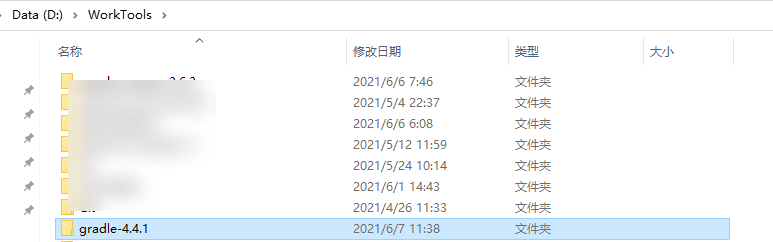

# 一、环境搭建

> **Spring版本：5.0.21.BUILD-SNAPSHOT**
>
> **IDEA版本：2019.3 U**
>
> **Gradle版本：4.4.1**
>
> **AspectJ版本：1.9.0**

1. Fork自己Spring源码仓，便于注释与调试

2. 安装Gradle

   1. 从Gradle官网下载gradle安装包 网址https://gradle.org/releases/

      

   2. 解压

      

   3. 配置环境变量

      

      

   4. 打开目录行工具，输入`gradle -v`，能看到gradle的版本信息表示安装已经成功

   

   

   

3. 导入Spring源码

   1. 从github拉取代码到本地

   2. 导入项目

      

      

   3. 解决导包问题

      **spring为了避免与cglib和objenesis冲突，将cglib和objenesis相关的包重新repack到`org.springframework.cglib`和`org.springframework.objenesis`包中，这部分的代码没有包含到源码当中。构建之前，需要先build这两个包。可以通过添加Gradle任务来解决：**

      在右侧的Gradle面板Spring -> Tasks -> other -> cglibRepackJar

      

      

      激活任务

      

      默认仓库网速下载较慢，添加阿里镜像仓库。

      

      ```java
      	repositories {
      		//新增以下2个阿里云镜像
      		maven { url 'https://maven.aliyun.com/nexus/content/groups/public/' }
      		maven { url 'https://maven.aliyun.com/nexus/content/repositories/jcenter' }
      		mavenCentral()
      		maven { url "https://repo.spring.io/libs-spring-framework-build" }
      		//新增spring插件库
      		maven { url "https://repo.spring.io/plugins-release" }
      	}
      ```

      

      重新构建项目（构建时间较长）

      

4. 创建测试模块

   - 为了方便编写测试spring的代码，在spring-framework单独新建一个模块my-test

     右键spring-framework项目->New->Module...

     

   - 输入ArtifactId: my-test

     

   - 添加依赖：`api(project(":spring-context"))`

     

   - 为了能让my-test自动导入相关的依赖，在Gradle面板中右键spring节点 

   

   - 在my-test模块中编写程序测试

     - 创建`MyApplication`

       ```java
       package com.geekjk;
       
       import org.springframework.context.ApplicationContext;
       import org.springframework.context.support.ClassPathXmlApplicationContext;
       
       public class MyApplication {
       
       	public static void main(String[] args) {
       		ApplicationContext ac = new ClassPathXmlApplicationContext("classpath:applicationContext.xml");
       		Hello hello = (Hello)ac.getBean("hello");
       		hello.sayHello();
       	}
       
       }
       ```

       

     - 在resources目录下新建`applicationContext.xml`

       ```java
       <?xml version="1.0" encoding="UTF-8"?>
       <beans xmlns="http://www.springframework.org/schema/beans"
              xmlns:xsi="http://www.w3.org/2001/XMLSchema-instance"
              xsi:schemaLocation="http://www.springframework.org/schema/beans http://www.springframework.org/schema/beans/spring-beans.xsd">
       
       	<bean id="hello" class="com.geekjk.Hello"></bean>
       
       </beans>
       ```

       

     - 新建`Hello`类

     ```java
     package com.geekjk;
     
     public class Hello {
     
     	public void sayHello() {
     		System.out.println("Hello, Spring!");
     	}
     
     }
     ```

     

     - 运行`MyApplication`，可以看到控制台输出：`Hello, Spring`!

   - 至此整个环境算是搭建好了,可以开始简单愉快的源码阅读之旅了。

      

> 书籍《Spring源码深度解析（第2版）》 作者郝佳


